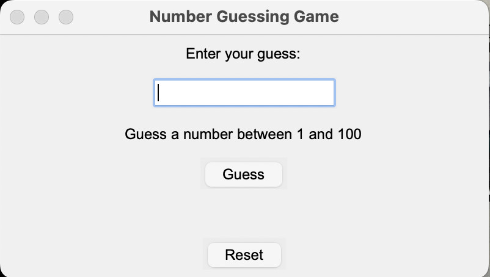
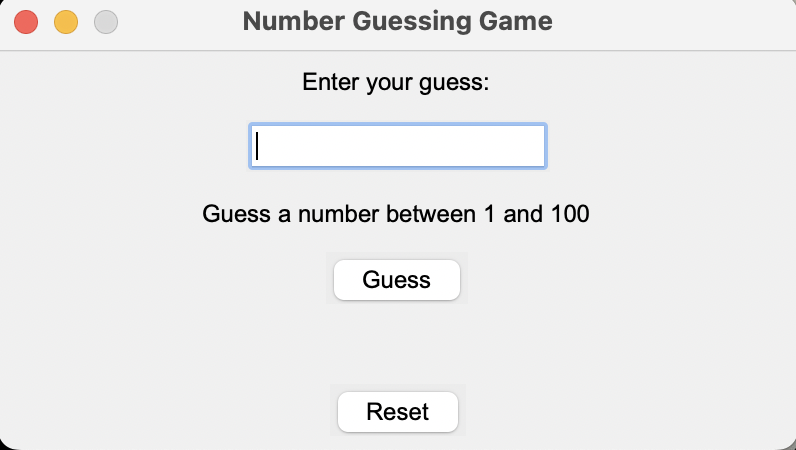
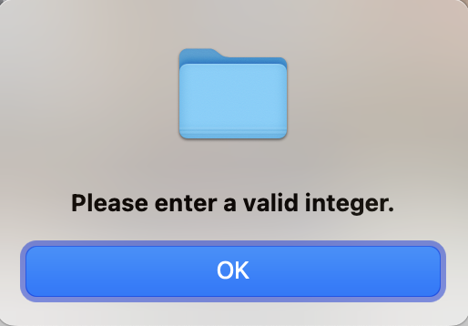

<!DOCTYPE html>
<html lang="en">
<head>
    <meta charset="UTF-8">
    <meta name="viewport" content="width=device-width, initial-scale=1.0">
</head>
<body>

<h1>Number Guessing Game</h1>

This is a simple Number Guessing Game developed using Python and Tkinter GUI toolkit. The game generates a random number between 1 and 100, and the player's task is to guess the correct number.

<h2>Features</h2>

<ul>
    <li>Guess a number between 1 and 100.</li>
    <li>Receive hints if the guess is too high or too low.</li>
    <li>Reset the game to play again.</li>
</ul>

<h2>Screenshots</h2>

Below are some screenshots of the game:

This is the starting screen of the game.

This is a hint indicating that the guessed number is too high.

This is a hint indicating that the guessed number is too low.

This is the reset button that allows the player to start a new game.

This is an example of an error message displayed when the user enters invalid input.

This is an example of an error message displayed when the user's guess is incorrect.

This is a message displayed when the user correctly guesses the number.

<h2>Getting Started</h2>

<ol>
    <li>Clone the repository to your local machine:</li>
    <code>git clone &lt;repository-url&gt;</code>
    <li>Navigate to the project directory:</li>
    <code>cd Number-Guessing-Game</code>
    <li>Run the game:</li>
    <code>python number_guessing_game.py</code>
</ol>

<h2>Usage</h2>

<ul>
    <li>Enter your guess in the provided entry field.</li>
    <li>Click the "Guess" button or press Enter to submit your guess.</li>
    <li>Receive feedback on whether your guess was too low, too high, or correct.</li>
    <li>Click the "Reset" button to start a new game.</li>
</ul>

<h2>Contributing</h2>

Contributions are welcome! If you find any issues or have suggestions for improvements, feel free to open an issue or create a pull request.

</body>
</html>
