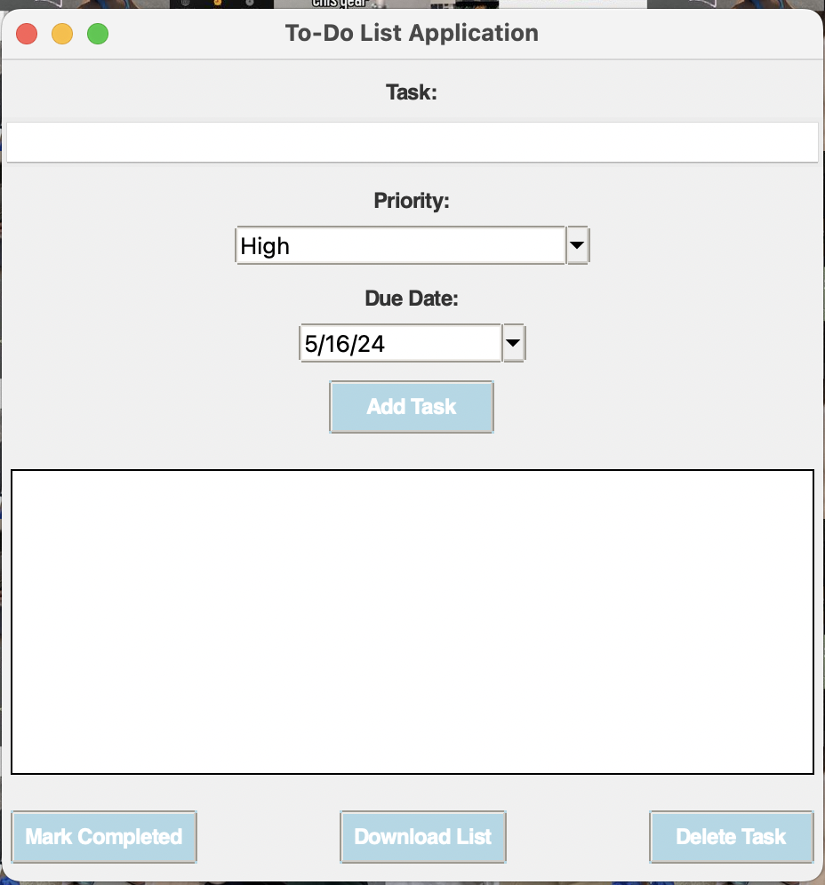

# To-Do List Application

This is a simple To-Do List Application built using Python and Tkinter GUI toolkit.

## Features

- Add tasks with priorities and due dates.
- Mark tasks as completed.
- Delete tasks from the list.
- Download the task list as a text file.

## Getting Started

1. Clone the repository to your local machine:

git clone <repository-url>

2. Navigate to the project directory:

cd To-Do-List-Application

3. Install the required dependencies:

pip install tk tkcalendar

4. Run the application:

python todo.py

## Usage

- Enter a task in the text box.
- Select the priority of the task from the dropdown menu.
- Choose a due date using the date picker.
- Click the "Add Task" button to add the task to the list.

- To mark a task as completed, select it from the list and click the "Mark Completed" button.

- To delete a task, select it from the list and click the "Delete Task" button.
- To download the task list as a text file, click the "Download List" button.

## Contributing

Contributions are welcome! If you find any issues or have suggestions for improvements, feel free to open an issue or create a pull request.
